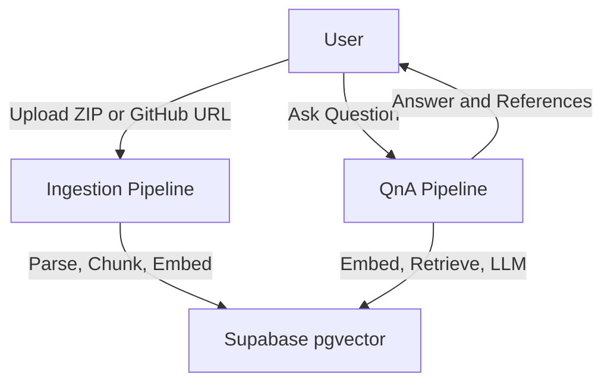
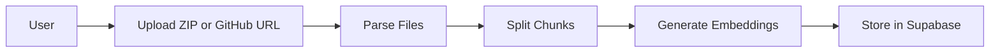
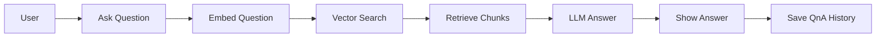

# Codebase QNA

**Live App:** [https://codebase-qna.vercel.app/](https://codebase-qna.vercel.app/)

---

## Overview

Codebase QNA is a web app that lets you upload a codebase (zip or GitHub URL) and ask questions about it. The app returns answers with file paths, line numbers, and code snippets, and saves your last 10 Q&As. Built with Next.js, Supabase, and OpenAI LLMs.

---

## System Architecture

# Codebase QNA

**Live App:** [https://codebase-qna.vercel.app/](https://codebase-qna.vercel.app/)

---

## Overview

Codebase QNA is a web app that lets you upload a codebase (zip or GitHub URL) and ask questions about it. The app returns answers with file paths, line numbers, and code snippets, and saves your last 10 Q&As. Built with Next.js, Supabase, Xenova Transformers, and OpenRouter LLM API.

---

## System Architecture

---

## Phase 1: Ingestion Pipeline

**Goal:** Index a codebase for semantic search.

**Steps:**

1. User uploads a ZIP or enters a GitHub repo URL.
2. Backend extracts and parses code files.
3. Files are split into chunks.
4. Each chunk is embedded using Xenova/all-MiniLM-L6-v2 (384-dim).
5. Chunks and embeddings are stored in Supabase (pgvector).

**Visual:**

---

## Phase 2: Q&A Pipeline

**Goal:** Answer questions about the codebase with proof.

**Steps:**

1. User asks a question.
2. The question is embedded (Xenova/all-MiniLM-L6-v2).
3. Vector search retrieves relevant code chunks from Supabase.
4. Chunks and question are sent to OpenRouter LLM API.
5. LLM returns an answer with file paths, line numbers, and code snippets.
6. The answer and references are shown in the UI and saved.

**Visual:**

---
